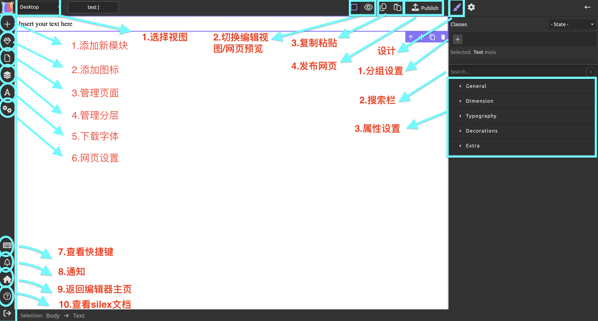

## 基础功能

{: .warning }
>由于编辑器的有些功能还没确定下来，这个overview只是个草稿，图画的可能会有点拉，之后功能确定了会改

### 左侧工具栏
1. 添加新模块
2. 添加图标
3. 管理页面
4. 管理分层
5. 下载字体
6. 网页设置
7. 查看快捷键
8. 通知
9. 返回编辑器主页
10. 查看silex文档

### 右侧工具栏
#### 设计
1. 管理组
2. 搜索栏
3. 通用
4. 尺寸
5. 字体样式
6. 装饰
7. 额外功能
#### 设置
1. 1

### 上方工具栏
1. 选择视图
2. 缺环编辑视图/网页预览
3. 复制粘贴
4. 发布网页

## 基础模块
本编辑器中含有5个基础模块。这五个基础模块将帮助你构造你网站中的大部分内容。
### 文本
点击文本模块即可对其中的内容进行编辑。编辑好文本后，在页面左侧的属性栏中可修改文本的属性。

其中，“typography”为最常用的属性，您可以在其中更改文本的字体，字号，大小，颜色等。如想了解“General”等属性的用法，请前往[编辑网站（进阶)](https://keycas-doc.github.io/docs/Editing-webpage-advanced/).

### 卡片与卡片容器
卡片是一个容纳图片+文本的组合模块，你可以通过它更加清晰明了地展示你的内容。在一个卡片中，双击灰色区域选择图片插入，单击文本编辑。