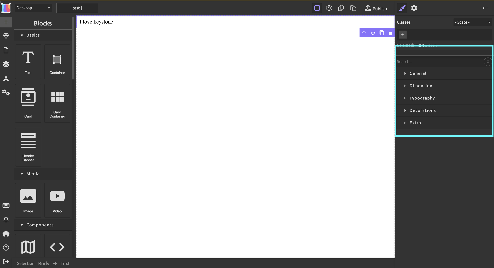

# 编辑网站
{: .important}
>~~如果您之前没有使用Ps，Wordpress等图像或网页编辑器的经验，建议先移步至[基础功能](https://keycas-doc.github.io/docs/basic-functions/)~~

点击您刚刚创建的网页草稿，以下页面将会出现：

接下来，您可以向您的网站中添加模块。点击左上角的 `+`，将你需要的模块拖动到画布上。

通过将不同的元素拖动到画布上进行组合，您可以创造出您想要的视觉效果。
## 基础模块
本编辑器中含有5个基础模块。这五个基础模块将帮助你构造你网站中的大部分内容。
### 文本
点击文本模块即可对其中的内容进行编辑。编辑好文本后，在页面左侧的属性栏中可修改文本的属性。

其中，“typography”为最常用的属性，您可以在其中更改文本的字体，字号，大小，颜色等。如想了解“General”等属性的用法，请前往[编辑网站（进阶)](https://keycas-doc.github.io/docs/Editing-webpage-advanced/).

### 卡片与卡片容器
卡片是一个容纳图片+文本的组合模块，你可以通过它更加清晰明了地展示你的内容。在一个卡片中，双击灰色区域选择图片插入，单击文本编辑。