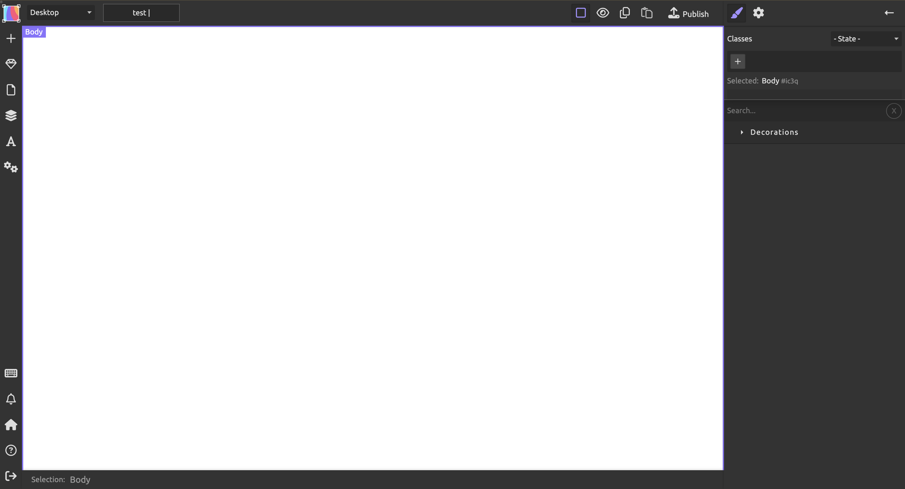
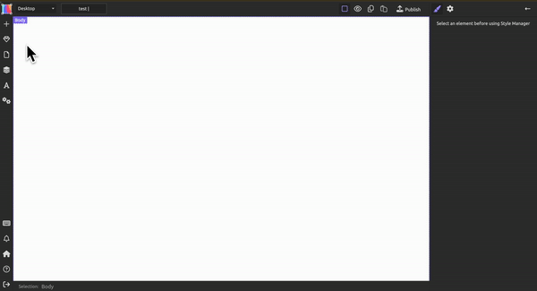

# 编辑网站
{: .important}
>~~如果您之前没有使用Ps，Wordpress等图像或网页编辑器的经验，建议先移步至[基础功能](https://keycas-doc.github.io/docs/basic-functions/)~~

{: .important}
>以下是为想要从头开始创造网页的用户准备的全流程文档；如果您准备使用模版，可以通过下方目录直接跳转到您感兴趣的模块，以了解该模块的使用方法。

点击您刚刚创建的网页草稿，以下页面将会出现：

接下来，您可以向您的网站中添加模块。点击左上角的 `+`，将你需要的模块拖动到画布上。

通过将不同的元素拖动到画布上进行组合，您可以创造出您想要的视觉效果。
# 基础模块
### 卡片（card）= 文本(text) + 图片 （image）
首先，在左侧工具栏中找到“card”，并将其拖拽至画布上。卡片是一个十分实用的，容纳图片+文本的组合模块，你可以通过它图文并茂地地展示你的内容。在一个卡片中，双击灰色区域选择图片插入，双击文本编辑内容。

### 容器 (container)
接下来，在左侧工具栏中找到“container”，将其拖动至画布上。在右侧属性栏中，点开“extra”，找到“column count”，将其调到2，并尝试将两个卡片拖入容器内。

{: .important}
>如果您在这个过程中发现选中容器十分困难，您可以在左侧工具栏的 中选中容器。
>这个功能在之后的网页编辑中也将派上用场。您还可以在其中整理、归纳您网页中的分层

（此处应有gif）

{: .note}
>恭喜您解锁了网站编辑的核心功能——排版👏
>
>除了卡片，容器还可以容纳，排列按钮，文本等其他元素
>
>当然，如果您认为新建一个容器过于麻烦，您也可以选择直接使用“card container”等现成的模块来快速创造多个卡片。

## 更多文本/图片模块
除了卡片，本编辑器中还含有多个现成的文本+图片模块供您使用，以创造更好的视觉效果。在此简单介绍一下：
### 标题横幅 (Header Banner)
可以充当您网页的标题，并以一张图片作为背景。

### 作者介绍 (Author Bio)
头像图片与文字的结合，可以帮助您介绍您的团队成员。
### 时间线（Time Line）

### 特性 (features)

# 交互模块
本编辑器中含有多个交互模块。您可以利用这些模块来与用户进行互动，丰富用户体验，或者获取用户信息。

### 按钮
您可以在您的网页上布置按钮来实现页面的跳转。

在左侧工具栏中找到页面管理(),并点击加号，给新页面命名之后选择"ok"

在模块中找到任意含有按钮的模块（如navbar）,将其拖动至画布上。选中其上面的任意一个按钮，（如navbar中的"about"）。找到右侧工具栏上的的设置按钮(),在"link"旁边的"type"选项框中选择"pages",并在下方出现的"page name"中选择您刚刚创建页面的名字。这样，用户在您的网页中点击该按钮就会跳转至您新建的页面。

您也可以通过改变"type"中的选项来让按钮担任别的功能，如跳转到外部url。

(此处需要image/gif)

## 含有按钮的复合模块

### 导航栏 (Navbar)
即导航栏，由logo，文字和按钮组成，是在网页最上端用于引导用户的模块。左侧的logo（如何编辑？？？）既可以展示logo，又可以起到按钮的作用。
### Hero
由一个背景图，文字，和一个按钮组成的模块。用于在网页前段吸引用户注意力。可以理解为带交互的Header Banner。

### 页眉/页脚 (Header/Footer)
Header与navbar类似，不过左侧显示的是网页名称而非logo，名称同也可以用与logo相同的方式来增加互动；footer在具有导航功能的同时也可以容纳联系方式，项目介绍等信息。

### Check Box

### Slider
没整明白

## 输入 (Input)
### Form

## 下拉栏 (Select)

