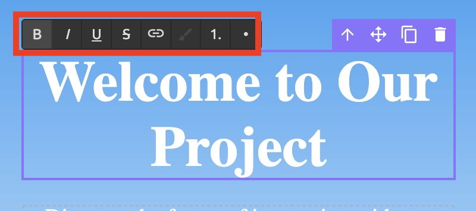
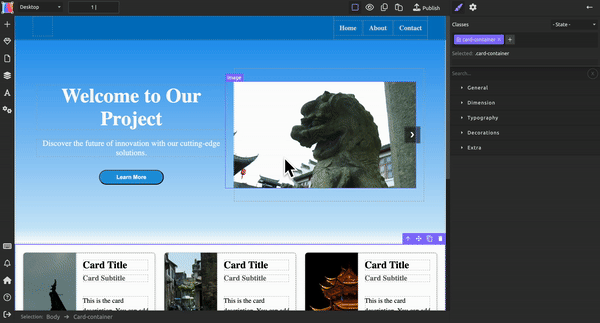
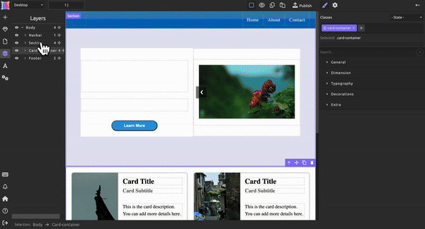
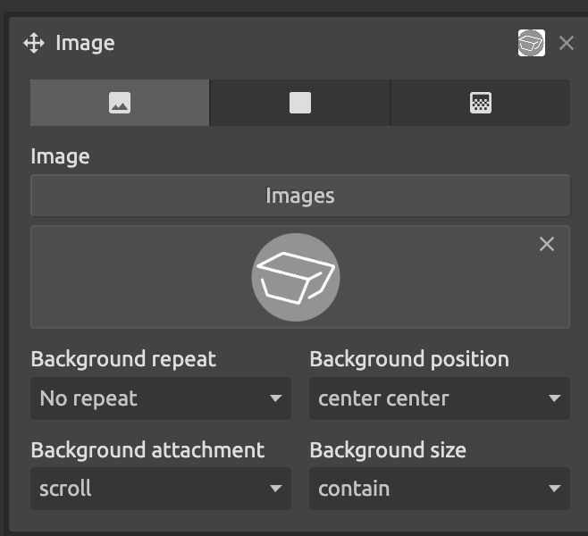

# 编辑模版
进入编辑界面后，您可以开始在其基础上创建您的网站。这里将以一个现成模版为示例进行介绍

## 编辑文字
在模版上的任意文字处，双击即可对其进行编辑。在编辑状态下，可通过使用文本框上方的按钮来进行基本的效果调整（如加粗）

若您想要更改文字的字体、字号、颜色等，则需在右侧工具栏找到"typography"，进行编辑。在编辑过程中，您还可以上下拖动文本框右侧的图标来更加直观地进行改动（如下图中在使用本方法调整字体大小）

## 更改图片
若您想要更改模版中的某一图片，您可以双击该图片模块，根据弹出界面的指示，从本地上传。

## 更改背景颜色/图片
若您想要更改任何模块的背景颜色，您可以先通过点击左侧的图标，选中您想要更改颜色的模块（当鼠标在模块名称上移动时，对应模块会有紫色边框指示）；再在右侧工具栏中找到"Decoration"下的"background color"进行更改；您也可以在下方的"background"一栏中点击加号，选择添加图片或渐变色。

## 添加子网站
如果您想通过添加子网站来为您的网站增添内容，您可以在右侧工具栏中找到按钮，并在弹出页面中选择“+”，以添加一个新的页面作为您的子网站。子网站独立于您的主站，且您可以通过跳转的方式来实现网站之间的转换（详见按钮-功能）。

## 设置按钮
### 样式
若您想要改变按钮的样式，您可以在选中按钮后去右侧工具栏的“decoration”一栏下面调节按钮的颜色（同上）、四角弧度（border radius）、阴影（border shadow）、边框（border）等。
### 功能
若您想更改按钮的功能，您需要在左侧工具栏中选中图标，在“link”一栏的"type"下拉栏中选择您想要的功能。如果您想进行页面跳转，则需在下拉栏中选择“Page”，并弹出的"Page name"中选中您想跳转至的页面。这样，用户在点击这个按钮后就会被跳转至您的指定页面。

## 添加网站图标
您可以通过更改模版左上角名为“Link”的模块，为您的网站添加图标。您在选中该模块后，在右侧工具栏"Decoration"下找到"Background"一栏，点击"+",将您的logo插入模块中。或者，如果您没有图标，您也可以直接双击该图标，插入文字。

当您将logo插入后，可能会出现其不显示或显示不全的情况：这一般是图标太大导致的。您可以通过调节logo下方的各种选项来将您的logo放在正确的位置上。下图是一个可供参考的使logo位置正确的位置组合。

与按钮一样，网站图标也可以实现网页跳转，更改方式与按钮相同。您可以将您图标的跳转目标设为主页，这样就可以实现很多网站都有的点图标回主页功能了。

## 设置slider
您可在slider中加入图片，卡片或任何您想要的内容。您可以通过双击slider中的图片来将其替换成您想要的图片。使用slider两边的左右按键即可在编辑页面里更改slider中其他页的照片。

## 设置卡片容器
卡片容器是模版中一个实用的模块。它能攻帮助您更加直观的展示您的内容。您可以使用上面提到的方法修改卡片的图片和文字内容；若想增加卡片数量，您可以在左侧工具栏的部分中选中任意一个卡片，并将其复制粘贴/删除。

